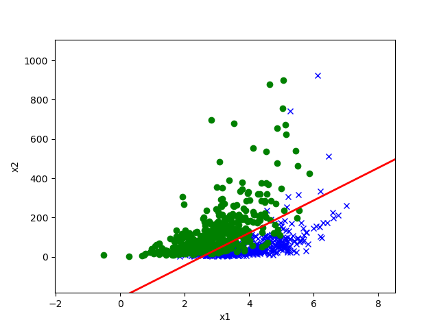
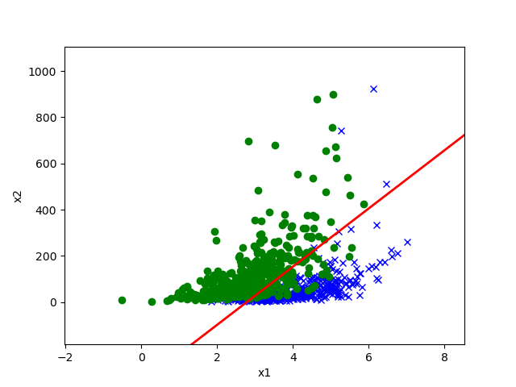
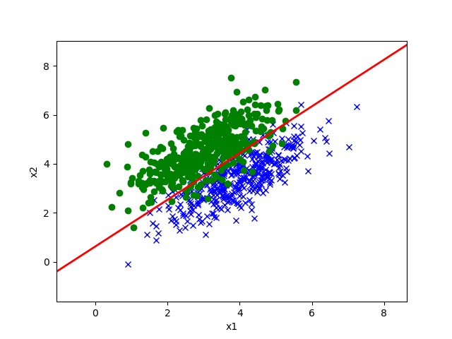
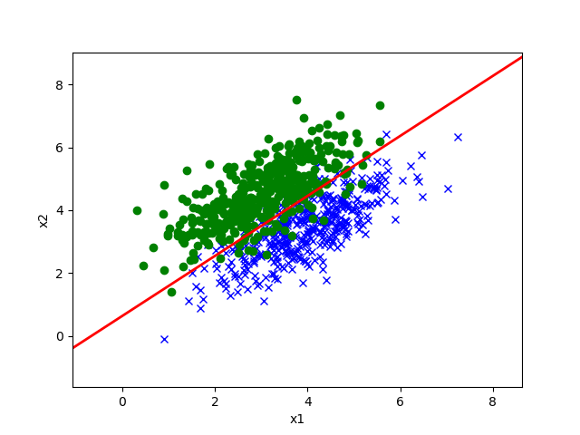
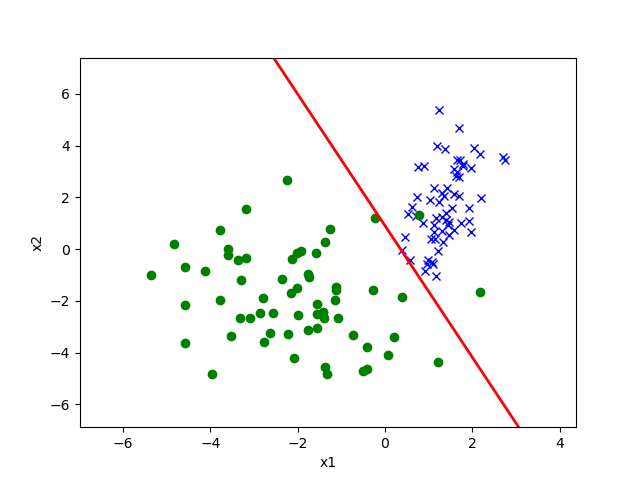
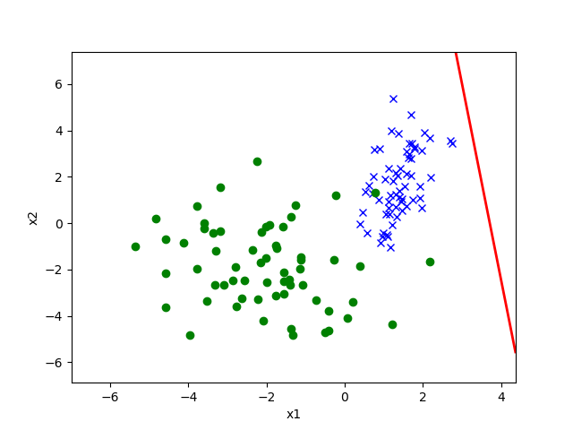
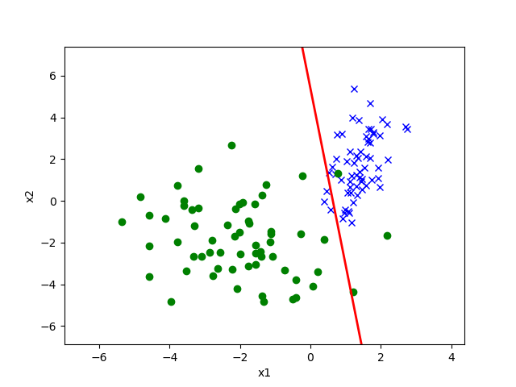

## Prb.1

### (a)

$$
\dfrac{\partial J(\theta)}{\partial \theta_i} = -\dfrac{1}{m}\sum_{k=1}^m x_i^{(k)}(y^{(k)}-g(\theta^Tx^{(k)}))\\
\dfrac{\partial^2 J(\theta)}{\partial \theta_i \partial \theta_j} = \dfrac{1}{m}\sum_{k=1}^m g(\theta^Tx^{(k)})(1-g(\theta^Tx^{(k)}))x_i^{(k)}x_j^{(k)}\\
H = \dfrac{1}{m} \sum_{k=1}^m g(\theta^Tx^{(k)})(1-g(\theta^Tx^{(k)}))x^{(k)}x^{(k)T}
$$

we just need to proof with a specific k. (then add them up)

note that the below $x$ is actually $x^{(k)}$.
$$
H = \sum_{i=1}^m H^{(k)}\\
H^{(k)} = \dfrac{g(\theta^Tx)(1-g(\theta^Tx))}{m}xx^T\\
\begin{aligned}
z^TH^{(k)}z &= \dfrac{g(\theta^Tx)(1-g(\theta^Tx))}{m}z^Txx^Tz\\
&= \dfrac{g(\theta^Tx)(1-g(\theta^Tx))}{m} (x^Tz)^2
\end{aligned}
$$
We have $(x^Tz)^2\ge 0$, and since $g(x)\in (0,1)$, we know that $\dfrac{g(\theta^Tx)(1-g(\theta^Tx))}{m}>0$, so $z^THz\ge 0$, $H$ is PSD.

### (c)

$$
\begin{aligned}
p(y=1|x) &= \dfrac{p(x|y=1)p(y=1)}{p(x|y=1)p(y=1)+p(x|y=0)p(y=0)}\\
&= \dfrac{\phi \exp(-\frac{1}{2}(x-\mu_1)^T\Sigma^{-1}(x-\mu_1))}{\phi \exp(-\frac{1}{2}(x-\mu_1)^T\Sigma^{-1}(x-\mu_1))+(1-\phi) \exp(-\frac{1}{2}(x-\mu_0)^T\Sigma^{-1}(x-\mu_0))}\\
&= \dfrac{1}{1+\exp\left( \log\dfrac{1-\phi}{\phi} + \dfrac{1}{2}((x-\mu_1)^T\Sigma^{-1}(x-\mu_1)-(x-\mu_0)^T\Sigma^{-1}(x-\mu_0)) \right)}\\
\end{aligned}
$$

and 
$$
\begin{aligned}
& \exp\left( \log\dfrac{1-\phi}{\phi} + \dfrac{1}{2}((x-\mu_1)^T\Sigma^{-1}(x-\mu_1)-(x-\mu_0)^T\Sigma^{-1}(x-\mu_0)) \right)\\
&=\exp\left( - \left[\dfrac{1}{2}(-(x-\mu_1)^T\Sigma^{-1}(x-\mu_1)+(x-\mu_0)^T\Sigma^{-1}(x-\mu_0)) + \log\dfrac{\phi}{1-\phi} \right] \right)\\
&=\cdots\\
&=\exp\left( - \left[\dfrac{1}{2}(\mu_1^T\Sigma^{-1}+\mu_1^T\Sigma^{-T}-\mu_0^T\Sigma^{-1}-\mu_0^T\Sigma^{-T})x + \dfrac{1}{2}(\mu_0^T\Sigma^{-1}\mu_0-\mu_1^T\Sigma^{-1}\mu_1)   +\log\dfrac{\phi}{1-\phi} \right] \right)\\
\end{aligned}
$$
so, we have
$$
\theta_0 = \dfrac{1}{2}(\mu_0^T\Sigma^{-1}\mu_0-\mu_1^T\Sigma^{-1}\mu_1)   +\log\dfrac{\phi}{1-\phi}\\
\theta^T = \dfrac{1}{2}(\mu_1^T\Sigma^{-1}+\mu_1^T\Sigma^{-T}-\mu_0^T\Sigma^{-1}-\mu_0^T\Sigma^{-T})\\
\theta = \Sigma^{-1}(\mu_1-\mu_0)
$$

### (d)

below, $\Sigma = \sigma^2$

$$
\begin{aligned}
\ell(\phi,\mu_0,\mu_1,\Sigma) &= \sum_{i=1}^m \log p(x^{(i)}|y^{(i)}) + \log p(y^{(i)})\\
&=\sum_{i=1}^m \left(\log \dfrac{1}{\sqrt{2\pi}\sigma}\right)+\left(-\dfrac{(x^{(i)}-\mu_{y^{(i)}})^2}{2\sigma^2}\right) + 1\{y^{(i)}=1\}\log \phi + 1\{y^{(i)}=0\}\log (1-\phi))
\end{aligned}
$$

for phi:

$$
\begin{aligned}
\dfrac{\partial }{\partial \phi}\ell(\phi,\mu_0,\mu_1,\Sigma) &= \sum_{i=1}^m 1\{y^{(i)}=1\} (\dfrac{1}{\phi}+\dfrac{1}{1-\phi})-\dfrac{1}{1-\phi}\\
 \sum_{i=1}^m 1\{y^{(i)}=1\} (\dfrac{1}{\phi(1-\phi)})&=\dfrac{m}{1-\phi} \ \ \ \ \text{set  partial derivative to zero}\\
 \dfrac{1}{m}\sum_{i=1}^m 1\{y^{(i)}=1\} &=\phi \\
\end{aligned}
$$

for $\mu_0,\mu_1$:(they are almost the same, so here is $\mu_0$ only.)

$$
\begin{aligned}
\dfrac{\partial }{\partial \mu_0}\ell(\phi,\mu_0,\mu_1,\Sigma) &= \sum_{i=1}^m 1\{y^{(i)}=0\}\dfrac{2(x^{(i)}-\mu_{0})}{2\sigma^2}\\
\sum_{i=1}^m 1\{y^{(i)}=0\} x^{(i)}-1\{y^{(i)}=0\}\mu_{0}&=0\\
\sum_{i=1}^m 1\{y^{(i)}=0\} x^{(i)}&=\mu_{0}\sum_{i=1}^m1\{y^{(i)}=0\}\\
\mu_0&=\dfrac{\sum_{i=1}^m 1\{y^{(i)}=0\} x^{(i)}}{\sum_{i=1}^m1\{y^{(i)}=0\}}
\end{aligned}
$$

for sigma:
$$
\begin{aligned}
\dfrac{\partial }{\partial \Sigma}\ell(\phi,\mu_0,\mu_1,\Sigma)&=\dfrac{\partial }{\partial \Sigma}\sum_{i=1}^m \left(\log \dfrac{1}{\sqrt{2\pi\Sigma}}\right)+\left(-\dfrac{(x^{(i)}-\mu_{y^{(i)}})^2}{2\Sigma}\right)\\
&=\sum_{i=1}^m  \dfrac{-1}{2\Sigma}+\dfrac{(x^{(i)}-\mu_{y^{(i)}})^2}{2\Sigma^2}\\

\end{aligned}
$$
set derivative to zero:
$$
\begin{aligned}
\sum_{i=1}^m  -1+\dfrac{(x^{(i)}-\mu_{y^{(i)}})^2}{\Sigma}&=0\\
\sum_{i=1}^m  (x^{(i)}-\mu_{y^{(i)}})^2 &=m\Sigma\\
\Sigma&=\dfrac{1}{m}\sum_{i=1}^m  (x^{(i)}-\mu_{y^{(i)}})^2

\end{aligned}
$$
if $\Sigma$ is a matrix then $\Sigma=\dfrac{1}{m}\sum_{i=1}^m  (x^{(i)}-\mu_{y^{(i)}})(x^{(i)}-\mu_{y^{(i)}})^T$

### (f)

### (g)

Dataset 1. The data in dataset 1 is less Gaussian-like than that in dataset 2.

### (h)

can't solve. performing $x_2\gets\log(x_2+1)$ can make both GDA and Logistic R get accuracy 95% in the test. i don't know how to make GDA significantly better.

## Prb.2

### (a)

$$
\begin{aligned}
\alpha &= \dfrac{p(y=1|x)}{p(t=1|x)}\\
&=\dfrac{p(y=1|x)p(x)}{p(x|t=1)p(t=1)}\\
&=\dfrac{p(x,y=1)}{p(x|t=1)p(t=1)}\\
&=\dfrac{p(x,y=1,t=1)}{p(x|t=1)p(t=1)} &&{ y=1\implies t=1}\\
&=\dfrac{p(x,y=1|t=1)}{p(x|t=1)} &&x,y\text{ are conditionally independent.}\\
&= p(y=1|t=1)
\end{aligned}
$$

### (b)

$$
\begin{aligned}
p(y^{(i)}=1|x^{(i)}) &=\dfrac{p(y^{(i)}=1,x^{(i)},t^{(i)}=1)}{p(x^{(i)})} \\
&= \dfrac{p(y^{(i)}=1|t^{(i)}=1)p(x^{(i)}|t^{(i)}=1)p(t^{(i)})}{p(x^{(i)})}\\
&= p(y^{(i)}=1|t^{(i)}=1)p(t^{(i)}|x^{(i)}=1)\\
&= p(y^{(i)}=1|t^{(i)}=1) = \alpha
\end{aligned}
$$

### (c)

### (d)

### (e)

## Prb.3

### (a)

$$
p(y;\lambda) = \dfrac{\exp(y\ln \lambda-\lambda)}{y!}\\
b(y) = \dfrac{1}{y!}\\
\eta = \ln \lambda\\
T(y) = y\\
a(\eta) =  \lambda = e^{\eta}
$$

### (b)

$$
g(\eta) = E[y;\eta] = \lambda = \exp(\eta)
$$

### (c)

$$
\begin{aligned}
\ell(\theta)= \log p (y^{(i)}|x^{(i)};\theta) &= \log \exp(y^{(i)}\ln e^{\theta^Tx^{(i)}}-e^{\theta^Tx^{(i)}}) - \log y^{(i)}!\\
&=y^{(i)}{\theta^Tx^{(i)}}-e^{\theta^Tx^{(i)}} - \log y^{(i)}!\\

\dfrac{\partial\ell(\theta)}{\partial \theta_j} &= x_j^{(i)}(y^{(i)}-e^{\theta^Tx^{(i)}})
\end{aligned}
$$

$$
\theta := \theta + \alpha(y^{(i)}-e^{\theta^Tx^{(i)}})x^{(i)}\ \ \ \ \text{for } i\in\{1,2,\cdots,m\}
$$

## Prb.4

### (a)

$$
\begin{aligned}
\int_Db(y)\exp(\eta y − a(\eta)) \mathrm{d} y &= 1 \\
\int_Db(y)\exp(\eta y)\mathrm{d}y &= \exp(a(\eta)) \\
\dfrac{\partial}{\partial \eta}\int_Db(y)\exp(\eta y)\mathrm{d}y &= a'(\eta)\exp(a(\eta))\\
\int_D\dfrac{\partial}{\partial \eta}b(y)\exp(\eta y)\mathrm{d}y &= a'(\eta)\exp(a(\eta))\\
\int_D yb(y)\exp(\eta y)\mathrm{d}y &= a'(\eta)\exp(a(\eta))\\
\int_D yb(y)\exp(\eta y - a(\eta))\mathrm{d}y &= a'(\eta)\\
\mathbb{E}[Y|X;\theta] &= a'(\eta)
\end{aligned}
$$

### (b)

$$
\begin{aligned}
\int_D yb(y)\exp(\eta y - a(\eta))\mathrm{d}y &= a'(\eta)\\
\int_D \dfrac{\partial}{\partial \eta}yb(y)\exp(\eta y - a(\eta))\mathrm{d}y &= a''(\eta)\\
\int_D yb(y)\times(y-a'(\eta))\exp(\eta y - a(\eta))\mathrm{d}y &= a''(\eta)\\
\int_D (y-a'(\eta))b(y)\times(y-a'(\eta))\exp(\eta y - a(\eta))\mathrm{d}y \ +\\ 
a'(\eta) \left(a'(\eta)-\int_D b(y)\times a'(\eta)\exp(\eta y - a(\eta))\mathrm{d}y\right)&=a''(\eta) \\
\int_D (y-a'(\eta))^2b(y)\exp(\eta y - a(\eta))\mathrm{d}y \ &=a''(\eta)\\
\mathrm{Var}(Y|X;\theta) &= a''(\eta)
\end{aligned}
$$

### (c)

$$
\begin{aligned}
L(\theta)=\prod_{k=1}^m  p(y^{(k)}|x^{(k)};\theta) &= \prod_{k=1}^mb(y^{(k)})\exp\left(\theta^Tx^{(k)}y^{(k)} - a(\theta^Tx^{(k)})\right)\\
-\ell (\theta) &= \sum_{k=1}^m a(\theta^Tx^{(k)})-\theta^Tx^{(k)}y^{(k)}+\log b(y^{(k)})\\
\dfrac{\partial}{\partial\theta_i}[-\ell (\theta)] &= \sum_{k=1}^m \left(a'(\theta^Tx^{(k)})x^{(k)}_i - x^{(k)}_iy^{(k)}\right)\\
H_{ij}=\dfrac{\partial^2}{\partial\theta_i\partial\theta_j}[-\ell (\theta)] &= \sum_{k=1}^m a''(\theta^Tx^{(k)})x^{(k)}_ix^{(k)}_j \\
z^THz &= \sum_{k=1}^m\sum_{i=1}^n\sum_{j=1}^n a''(\theta^Tx^{(k)})x^{(k)}_ix^{(k)}_j z_iz_j\\
z^THz &= \sum_{k=1}^ma''(\theta^Tx^{(k)})\sum_{i=1}^n\sum_{j=1}^n (x^{(k)}_i z_i)(x^{(k)}_jz_j)\\
z^THz &= \sum_{k=1}^ma''(\theta^Tx^{(k)})(x^{(k)T}z)^2
\end{aligned}
$$

since $a''(\theta^Tx)=a''(\eta)=\mathrm{Var}(Y|X;\theta) \ge 0 $, we have $z^THz\ge 0$, $H$ is PSD, so NLL is convex.

